# Centraliza

Plataforma full stack para **gestão centralizada de processos operacionais**, desenvolvida com React, Spring Boot, PostgreSQL e automação em Python/Selenium.

O projeto reúne em uma única solução:

* gestão de Call Backs;
* acompanhamento de Lembretes;
* Remanejamentos de agendas;
* busca integrada de pacientes;
* autenticação e autorização;
* usuários, cargos e permissões;
* auditoria;
* documentos PDF;
* automação de navegador;
* acompanhamento de execuções em tempo real.

> Este repositório funciona como a página principal do projeto.
> O código da aplicação está dividido entre os repositórios de frontend, backend e automação.

---

## Navegação

[📸 Demonstração completa](docs/DEMO.md) ·
[🌐 Frontend](https://github.com/pacheco-rfl/centraliza-portfolio-web) ·
[⚙️ API](https://github.com/pacheco-rfl/centraliza-portfolio-api) ·
[🤖 Automação](https://github.com/pacheco-rfl/centraliza-portfolio-automation)

---

## Demonstração completa

Quer conhecer todos os módulos da plataforma?

➡️ **[Ver demonstração completa do Centraliza](docs/DEMO.md)**

A demonstração apresenta Call Backs, Lembretes, Remanejamentos, busca integrada, automação, administração, auditoria, documentos, temas claro/escuro e a API documentada com Swagger.

---

# Visão geral

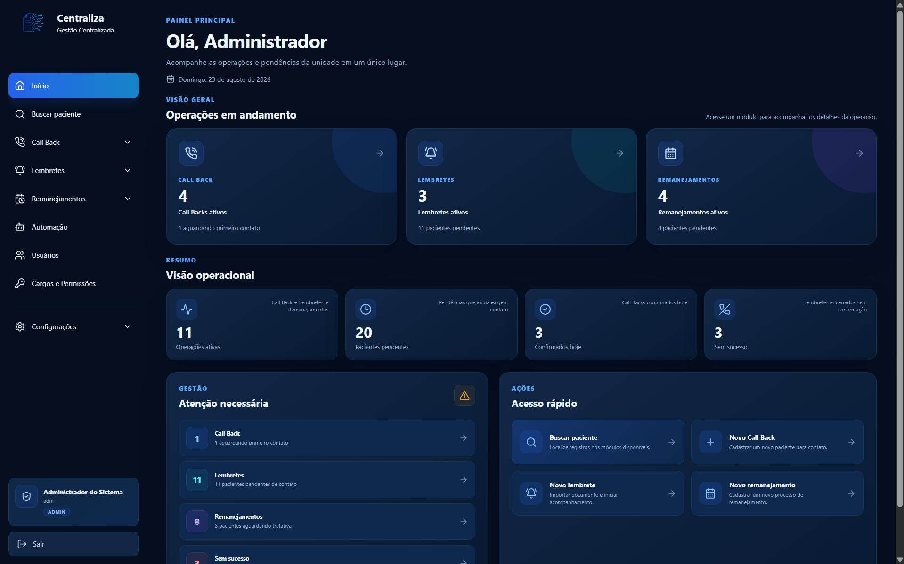

O Centraliza foi criado para demonstrar a construção de uma aplicação completa, indo além de operações CRUD tradicionais.

O projeto envolve diferentes tecnologias e responsabilidades:

```text
Frontend
   +
API REST
   +
Banco de dados
   +
Autenticação
   +
RBAC
   +
Auditoria
   +
Processamento de documentos
   +
Automação
   +
Integração Java/Python
   +
CI
```

A versão pública foi adaptada para portfólio e utiliza somente dados, pacientes, profissionais, documentos e ambientes fictícios.

---

# Ecossistema

O Centraliza é dividido em três projetos independentes.

| Projeto                   | Tecnologias                   | Responsabilidade                                     |
| ------------------------- | ----------------------------- | ---------------------------------------------------- |
| **Centraliza Web**        | React, TypeScript, Vite       | Interface e experiência do usuário                   |
| **Centraliza API**        | Java, Spring Boot, PostgreSQL | Regras de negócio, segurança e persistência          |
| **Centraliza Automation** | Python, Selenium              | Automação de navegador e processamento demonstrativo |

### Repositórios

**Frontend**

https://github.com/pacheco-rfl/centraliza-portfolio-web

**Backend**

https://github.com/pacheco-rfl/centraliza-portfolio-api

**Automação**

https://github.com/pacheco-rfl/centraliza-portfolio-automation

---

# Arquitetura

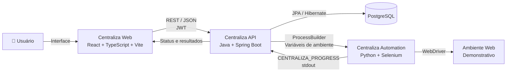

A aplicação segue uma separação clara de responsabilidades.

O frontend não possui acesso direto ao PostgreSQL ou ao processo Python.

Toda operação passa pela API.

---

# Fluxo de uma requisição

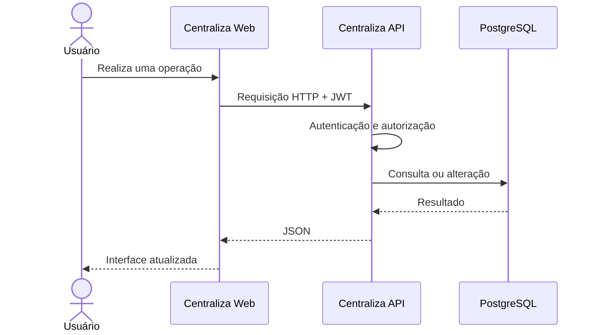

---

# Funcionalidades

## Dashboard

O dashboard reúne informações dos principais módulos em uma única tela.

São apresentados indicadores como:

* Call Backs ativos;
* Lembretes ativos;
* Remanejamentos ativos;
* pacientes pendentes;
* confirmações;
* operações sem sucesso;
* ações que necessitam de atenção;
* acessos rápidos.

---

## Call Backs

Gerenciamento de contatos relacionados a consultas.

Recursos disponíveis:

* cadastro de consultas;
* filtros;
* acompanhamento de status;
* tentativas de contato;
* conclusão;
* registros sem sucesso;
* histórico;
* auditoria;
* documentos anexados;
* visualização de PDF.

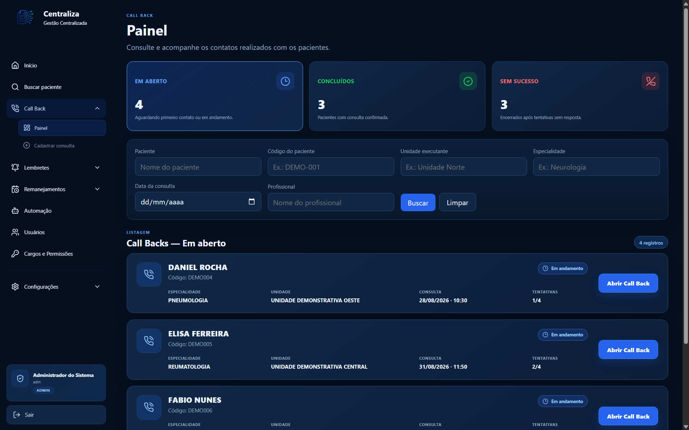

---

## Lembretes

Gerenciamento de agendas destinadas a lembretes de pacientes.

Permite acompanhar:

* profissional;
* especialidade;
* data;
* pacientes;
* confirmações;
* pendências;
* contatos sem sucesso;
* progresso.

---

## Remanejamentos

Controle de processos em que pacientes precisam ser transferidos de uma agenda para outra.

Cada processo apresenta:

* agenda original;
* nova agenda;
* profissional;
* especialidade;
* pacientes envolvidos;
* confirmados;
* recusados;
* registros sem sucesso;
* progresso.

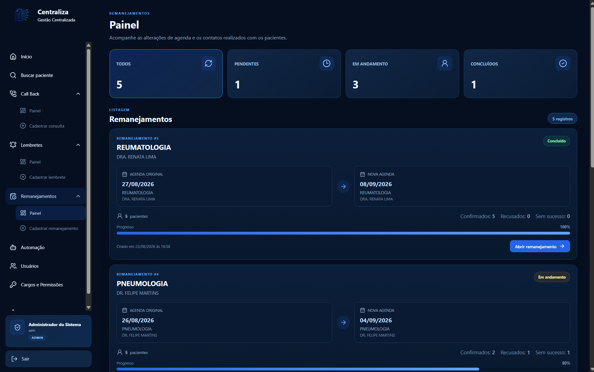

---

## Busca integrada

Uma única busca pode localizar registros relacionados ao mesmo paciente entre:

```text
Call Back
Lembretes
Remanejamentos
```

Isso permite consultar rapidamente em quais fluxos o paciente possui registros.

---

# Automação

Um dos principais componentes do projeto é a integração entre a aplicação Java e um processo Python responsável pela automação.

O usuário inicia o processo pelo frontend.

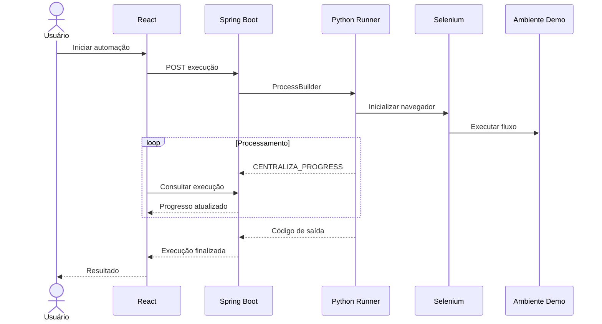

A interface permite acompanhar:

* execução em andamento;
* quantidade processada;
* registros agendados;
* falhas;
* registros ignorados;
* paciente atual;
* percentual de progresso;
* horário de início;
* horário de término;
* código de saída;
* interrupção da execução.

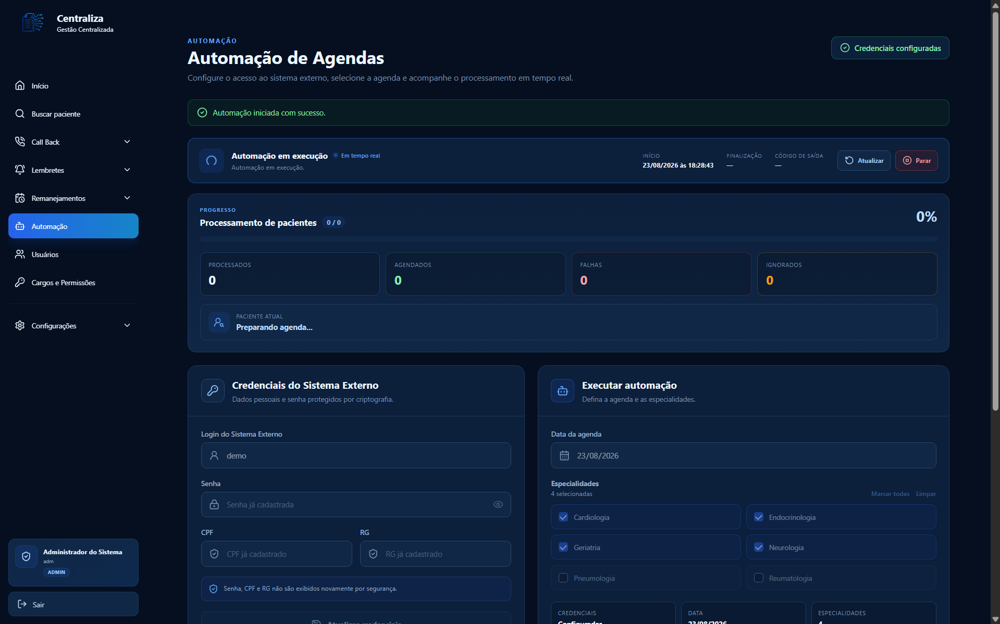

---

# Integração Java + Python

A automação não é iniciada diretamente pelo navegador.

O fluxo é:

```text
React
  │
  ▼
Spring Boot
  │
  │ ProcessBuilder
  ▼
Python Runner
  │
  ▼
Selenium
```

O backend cria um processo separado para executar:

```text
centraliza_runner.py
```

Configurações necessárias são enviadas ao processo através de variáveis de ambiente.

Durante o processamento, o Python gera mensagens especiais:

```text
[CENTRALIZA_PROGRESS]
```

O backend interpreta essas informações e atualiza o estado da execução.

---

# Segurança

O Centraliza possui diferentes camadas de segurança.

## Autenticação

A autenticação utiliza JWT.

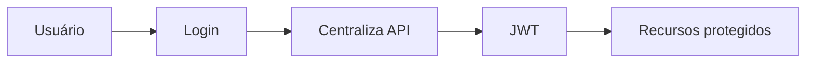

---

## RBAC

A autorização utiliza cargos e permissões específicas.

Perfis demonstrativos:

```text
Administrador
Atendente
Coordenação
Gestão
```

Um cargo pode possuir permissões como:

```text
Visualizar Call Back
Cadastrar Call Back
Atualizar Call Back

Cadastrar Lembretes
Editar Lembretes

Cadastrar Remanejamentos
Editar Remanejamentos

Configurar Automação
Registrar Contato
Gerenciar Usuários
```

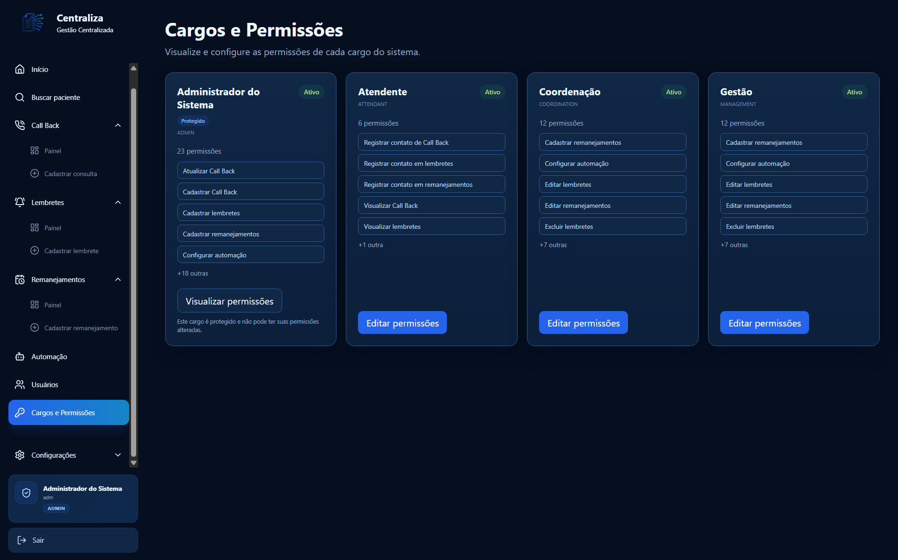

O frontend utiliza essas permissões para controlar a experiência do usuário.

A validação definitiva é realizada pela API.

---

# Proteção das credenciais da automação

Credenciais utilizadas pela automação não ficam armazenadas diretamente no frontend.

O fluxo é:

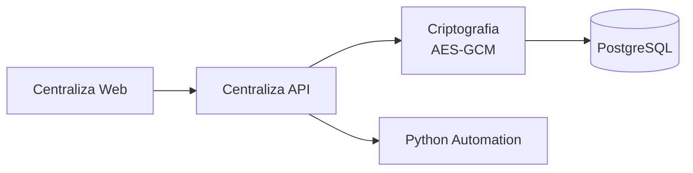

Após serem configuradas, informações sensíveis não são novamente exibidas na interface.

---

# Auditoria

Operações importantes possuem rastreabilidade.

O sistema registra eventos como:

```text
Criação

Alterações

Tentativas de contato

Mudanças de status

Conclusão

Encerramento sem resposta
```

Isso permite reconstruir o histórico operacional de determinados processos.

---

# Documentos

O Centraliza também possui funcionalidades relacionadas ao processamento e visualização de documentos.

No módulo de Call Back, por exemplo, é possível manter o documento original anexado ao registro e visualizá-lo diretamente pela aplicação.

A versão pública utiliza exclusivamente PDFs fictícios criados para demonstração.

---

# Banco de dados

A API utiliza:

```text
PostgreSQL
```

A evolução do schema é controlada com:

```text
Flyway
```

Isso permite versionar alterações estruturais no banco de dados junto com o código.

---

# Backend

O backend é desenvolvido com:

```text
Java
Spring Boot
Spring Security
Spring Data JPA
Hibernate
PostgreSQL
Flyway
JWT
Maven
JaCoCo
```

Responsabilidades principais:

* autenticação;
* autorização;
* regras de negócio;
* persistência;
* auditoria;
* processamento de documentos;
* gerenciamento da automação;
* armazenamento protegido de credenciais;
* API REST.

Repositório:

https://github.com/pacheco-rfl/centraliza-portfolio-api

---

# Frontend

O frontend é desenvolvido com:

```text
React
TypeScript
Vite
React Router
CSS
Lucide React
```

Responsabilidades:

* interface;
* navegação;
* autenticação;
* rotas protegidas;
* permissões;
* dashboards;
* formulários;
* acompanhamento operacional;
* visualização da automação.

Repositório:

https://github.com/pacheco-rfl/centraliza-portfolio-web

---

# Automação

O módulo de automação utiliza:

```text
Python
Selenium
WebDriver Manager
pandas
openpyxl
```

Responsabilidades:

* execução do fluxo demonstrativo;
* controle do navegador;
* processamento de registros;
* emissão de progresso;
* geração de relatórios;
* integração com a API.

Repositório:

https://github.com/pacheco-rfl/centraliza-portfolio-automation

---

# Integração contínua

Os três projetos possuem pipelines independentes através do GitHub Actions.

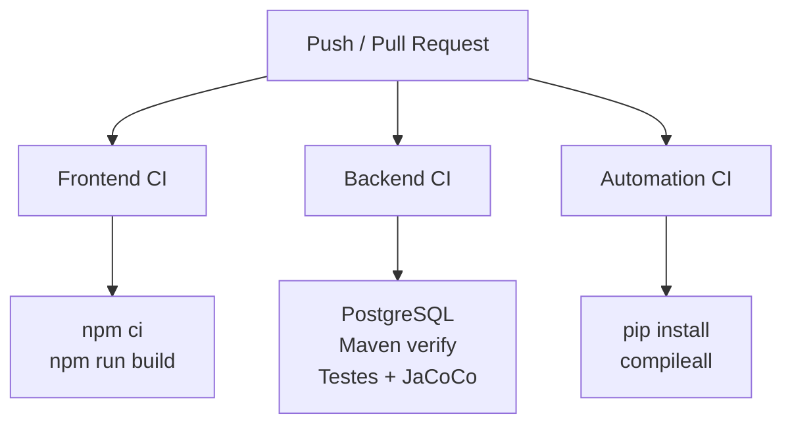

### Frontend CI

Valida:

```text
npm ci
npm run build
```

### Backend CI

Valida:

```text
PostgreSQL
Flyway
Compilação
Testes automatizados
JaCoCo
Maven verify
```

### Automation CI

Valida:

```text
Instalação das dependências
requirements.txt
Compilação dos módulos Python
Erros de sintaxe
```

A execução completa do Selenium é validada localmente.

---

# Demonstração visual

## Dashboard


---

## Call Backs


---

## Remanejamentos


---

## Automação em tempo real


---

## Cargos e permissões


---

# Ambiente demonstrativo

A versão pública foi preparada especificamente para portfólio.

Nenhum dado real é necessário.

São utilizados exemplos fictícios de:

* pacientes;
* profissionais;
* documentos;
* unidades;
* consultas;
* agendas;
* especialidades;
* CPF;
* RG;
* credenciais;
* sistemas externos.

O módulo Selenium utiliza um ambiente demonstrativo em vez de sistemas reais.

---

# Executando o ecossistema localmente

A forma recomendada é manter os três repositórios no mesmo diretório.

Exemplo:

```text
Desktop/
|
+-- centraliza-portfolio-api/
|
+-- centraliza-portfolio-web/
|
+-- centraliza-portfolio-automation/
```

---

## 1. Backend

Clone:

```bash
git clone https://github.com/pacheco-rfl/centraliza-portfolio-api.git
```

Entre no projeto:

```powershell
cd centraliza-portfolio-api
```

Configure:

```text
.env
```

A partir do:

```text
.env.example
```

No Windows, a execução recomendada é:

```powershell
.\scripts\run-local.cmd
```

O script:

```text
carrega o .env
      ↓
inicia PostgreSQL
      ↓
aguarda o banco
      ↓
inicia Spring Boot
```

A API ficará disponível em:

```text
http://localhost:8080
```

---

## 2. Automação

Clone:

```bash
git clone https://github.com/pacheco-rfl/centraliza-portfolio-automation.git
```

Entre no projeto:

```powershell
cd centraliza-portfolio-automation
```

Crie o ambiente:

```powershell
py -m venv .venv
```

Instale as dependências:

```powershell
.\.venv\Scripts\python.exe -m pip install --upgrade pip
```

```powershell
.\.venv\Scripts\python.exe -m pip install -r requirements.txt
```

No `.env` da API, configure o caminho desta automação.

Exemplo:

```env
AUTOMATION_PYTHON_EXECUTABLE=C:/caminho/centraliza-portfolio-automation/.venv/Scripts/python.exe

AUTOMATION_PYTHON_DIRECTORY=C:/caminho/centraliza-portfolio-automation
```

---

## 3. Frontend

Clone:

```bash
git clone https://github.com/pacheco-rfl/centraliza-portfolio-web.git
```

Entre:

```powershell
cd centraliza-portfolio-web
```

Crie o `.env`:

```powershell
Copy-Item .env.example .env
```

Instale:

```powershell
npm.cmd ci
```

Execute:

```powershell
npm.cmd run dev
```

A interface ficará disponível em:

```text
http://localhost:5173
```

---

# Login demonstrativo

Utilizando a configuração local padrão:

```text
Usuário: adm
Senha: Centraliza@123
```

Essas credenciais são utilizadas somente para desenvolvimento e demonstração local.

---

# Validação dos projetos

## API

```powershell
.\mvnw.cmd clean verify
```

---

## Frontend

```powershell
npm.cmd run build
```

---

## Automation

```powershell
.\.venv\Scripts\python.exe -m compileall centraliza_runner.py main.py config core modules systems
```

---

# Estrutura dos repositórios

```text
Centraliza
│
├── centraliza-portfolio-web
│   └── React + TypeScript + Vite
│
├── centraliza-portfolio-api
│   └── Java + Spring Boot + PostgreSQL
│
└── centraliza-portfolio-automation
    └── Python + Selenium
```

---

# Principais conceitos demonstrados

O projeto reúne conhecimentos de diferentes áreas de desenvolvimento.

### Frontend

* React;
* TypeScript;
* SPA;
* React Router;
* componentes;
* formulários;
* dashboards;
* integração REST;
* autenticação;
* RBAC;
* experiência responsiva.

### Backend

* Java;
* Spring Boot;
* API REST;
* Spring Security;
* JWT;
* RBAC;
* JPA;
* Hibernate;
* PostgreSQL;
* Flyway;
* criptografia;
* auditoria;
* tratamento de erros;
* testes automatizados.

### Automação

* Python;
* Selenium;
* WebDriver;
* processos externos;
* integração Java/Python;
* variáveis de ambiente;
* comunicação por stdout;
* processamento de registros;
* geração de relatórios.

### Engenharia

* Git;
* GitHub;
* CI;
* GitHub Actions;
* Docker;
* arquitetura em camadas;
* separação de responsabilidades;
* segurança;
* documentação;
* versionamento de banco de dados.

---

# Decisões de arquitetura

Algumas decisões importantes do projeto:

### Separação em três aplicações

Frontend, backend e automação possuem ciclos de desenvolvimento independentes.

Isso evita acoplamento excessivo entre as tecnologias.

### Backend como ponto central

A interface não se comunica diretamente com banco ou Python.

```text
Frontend → API → recursos internos
```

Isso mantém regras de negócio e segurança centralizadas.

### Automação como processo externo

Em vez de incorporar Python dentro da aplicação Java, o backend inicia um processo separado.

Isso permite que:

* Java gerencie a execução;
* Python permaneça responsável pela automação;
* Selenium utilize seu próprio ambiente;
* os componentes continuem independentes.

### Progresso via stdout

O processo Python envia eventos estruturados através da saída padrão.

Isso cria uma integração simples entre processos sem exigir que a automação tenha sua própria API HTTP.

---

# Status do projeto

A versão de portfólio possui:

* frontend funcional;
* API funcional;
* PostgreSQL;
* migrations;
* autenticação JWT;
* RBAC;
* usuários;
* cargos;
* permissões;
* Dashboard;
* Call Backs;
* Lembretes;
* Remanejamentos;
* busca integrada;
* documentos;
* auditoria;
* automação;
* integração Java/Python;
* Selenium;
* progresso da automação;
* interrupção da execução;
* testes no backend;
* pipelines de CI;
* documentação;
* ambiente demonstrativo.

---

# Objetivo

O Centraliza foi preparado como projeto de portfólio para demonstrar uma aplicação completa envolvendo múltiplas tecnologias.

O foco não está apenas em apresentar telas, mas em demonstrar conhecimentos de:

```text
Arquitetura
Segurança
Backend
Frontend
Banco de dados
Automação
Integração entre sistemas
Testes
CI
Documentação
```

---

# Repositórios

### Centraliza Web

React + TypeScript + Vite

https://github.com/pacheco-rfl/centraliza-portfolio-web

### Centraliza API

Java + Spring Boot + PostgreSQL

https://github.com/pacheco-rfl/centraliza-portfolio-api

### Centraliza Automation

Python + Selenium

https://github.com/pacheco-rfl/centraliza-portfolio-automation

---

# Autor

**Rafael Pacheco**

Projeto desenvolvido para demonstração de conhecimentos em desenvolvimento Full Stack, arquitetura de software, integração de sistemas e automação.

## Direitos Autorais

Copyright © 2026 Rafael Pacheco. Todos os direitos reservados.

Este projeto está disponível publicamente apenas para fins de portfólio, avaliação profissional e estudo.

Não é permitida a cópia, reprodução, modificação, distribuição ou utilização deste código, total ou parcialmente, sem autorização prévia e expressa do autor.

## Créditos

A ideia inicial do Centraliza foi discutida com Gabriel Henrique Lambiasi, que também contribuiu com um protótipo inicial da interface. O desenvolvimento da aplicação, incluindo back-end, front-end, banco de dados, segurança, testes, documentação e automação, foi realizado por Rafael Pacheco.
